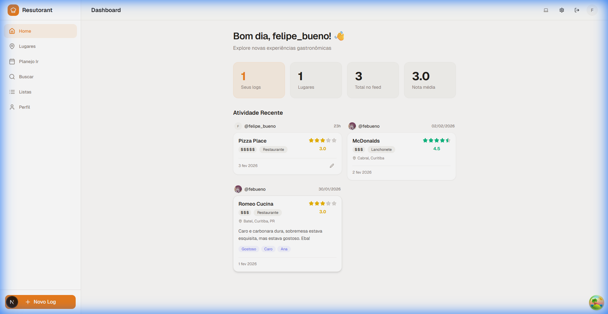
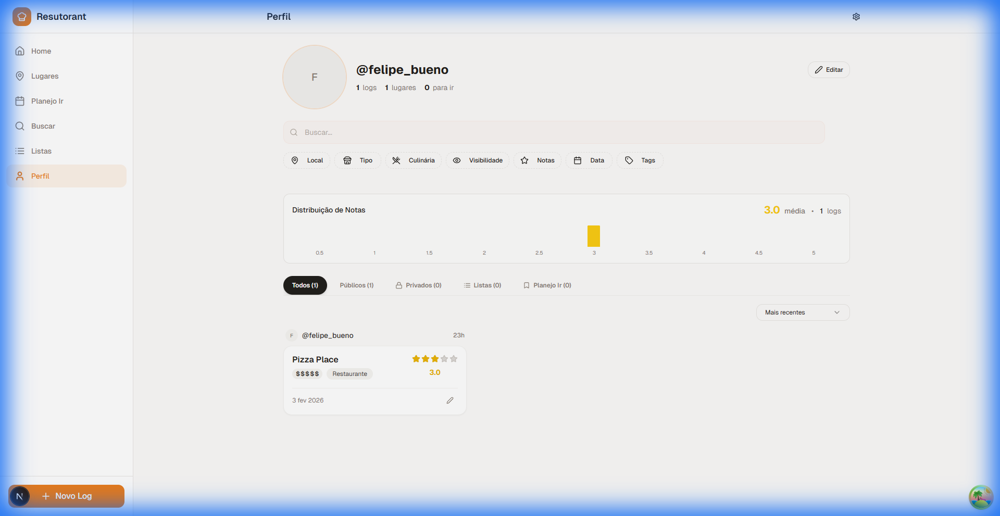
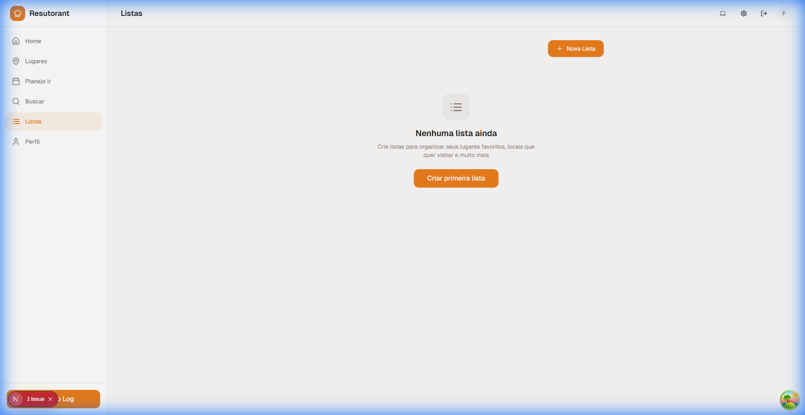
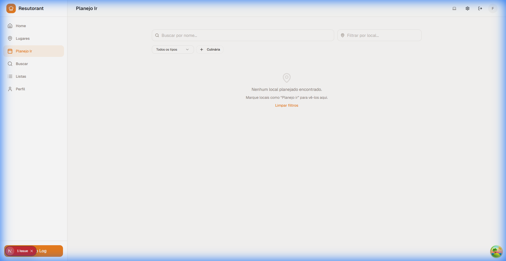
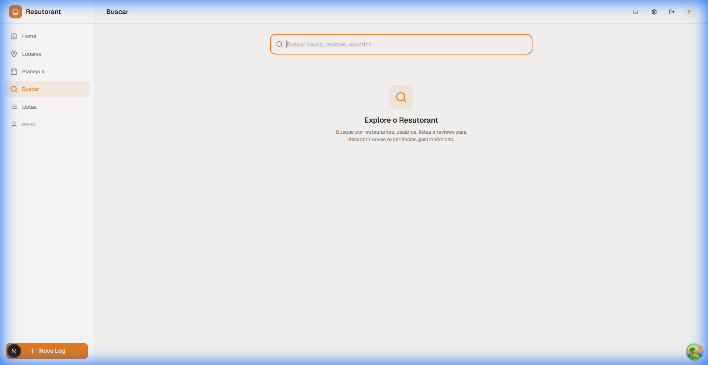
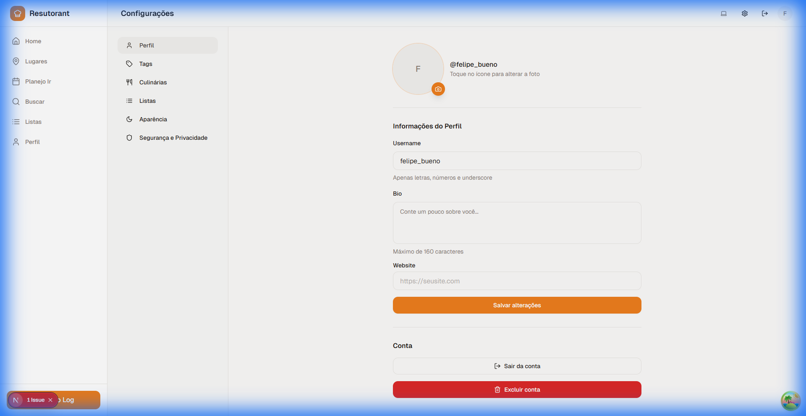

# Resutorant

Plataforma de avaliacao e planejamento gastronomico pessoal.

Este projeto permite aos usuarios registrar suas experiencias em restaurantes, criar listas de lugares para visitar e visualizar estatisticas detalhadas sobre seus habitos gastronomicos.

## Visao Geral

O Resutorant e uma aplicacao web moderna construida com Next.js, desenhada para ser uma ferramenta pessoal robusta para foodies e entusiastas da gastronomia. Oferece uma interface rica e responsiva para gerenciar memorias culinarias.

## Funcionalidades Principais

- **Dashboard:** Visao geral das ultimas atividades e metricas rapidas.
- **Avaliacoes Detalhadas:** Registre notas, precos, datas e tags personalizadas para cada visita.
- **Listas e Planejamento:** Organize restaurantes em listas (ex: "Melhores Burger", "Jantar Romantico") e mantenha uma lista de "Planejo Ir".
- **Busca Avancada:** Encontre rapidamente restaurantes ja visitados ou salvos.
- **Perfil e Estatisticas:** Analise seus habitos com graficos interativos e historico completo.
- **Configuracoes Personalizaveis:** Gerencie tags, cozinhas e preferencias da conta.
- **Autenticacao Segura:** Sistema de login robusto e seguro via Supabase.

## Stack Tecnologico

- **Framework:** Next.js (App Router)
- **Linguagem:** TypeScript
- **Estilizacao:** Tailwind CSS
- **Componentes UI:** Radix UI, Lucide React
- **Animacoes:** Framer Motion
- **Gerenciamento de Estado/Dados:** TanStack Query (React Query)
- **Formularios:** React Hook Form, Zod
- **Graficos:** Recharts
- **Backend & Banco de Dados:** Supabase
- **Utilitarios:** date-fns, clsx, tailwind-merge

## Capturas de Tela

### Dashboard



### Perfil do Usuario



### Listas



### Planejamento



### Busca



### Configuracoes



## Como Iniciar

Siga estas instrucoes para configurar o projeto localmente.

### Pre-requisitos

- Node.js (versao LTS recomendada)
- npm ou yarn

### Instalacao

1.  Clone o repositorio:

    ```bash
    git clone https://github.com/seu-usuario/resutorant.git
    cd resutorant
    ```

2.  Instale as dependencias:

    ```bash
    npm install
    ```

3.  Configure as variaveis de ambiente:
    Crie um arquivo `.env.local` na raiz do projeto e adicione as chaves do Supabase:

    ```env
    NEXT_PUBLIC_SUPABASE_URL=sua_url_supabase
    NEXT_PUBLIC_SUPABASE_ANON_KEY=sua_chave_anonima
    ```

4.  Inicie o servidor de desenvolvimento:

    ```bash
    npm run dev
    ```

5.  Acesse a aplicacao em `http://localhost:3000`.

## Estrutura do Projeto

- `/app`: Rotas e paginas da aplicacao (Next.js App Router).
- `/components`: Componentes reutilizaveis de UI.
- `/lib`: Funcoes utilitarias, hooks e configuracoes.
- `/public`: Arquivos estaticos.
- `/screenshots`: Imagens utilizadas neste README.

---

Desenvolvido por Felipe Bueno.
