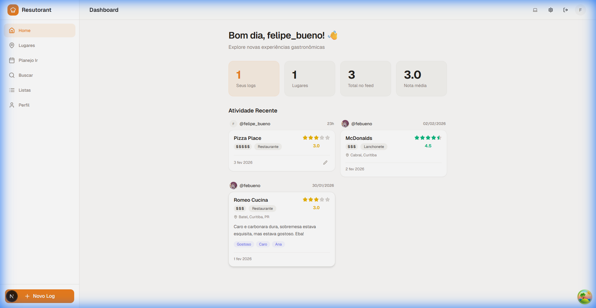
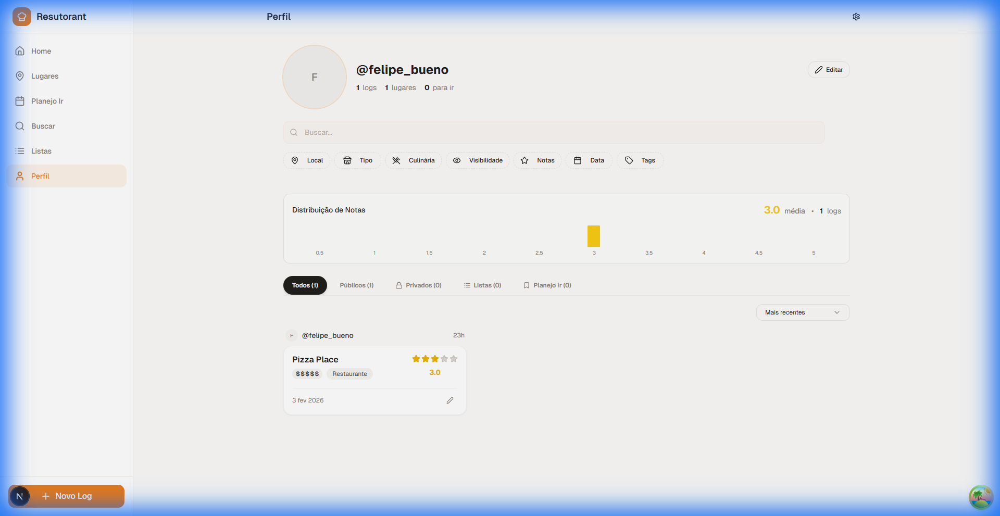
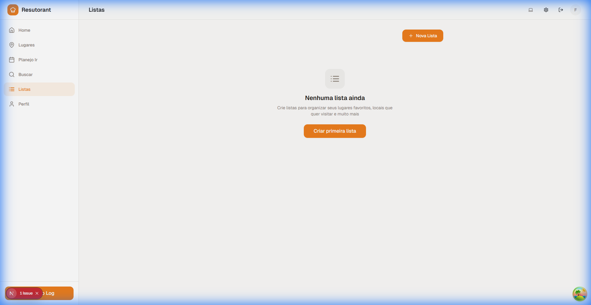
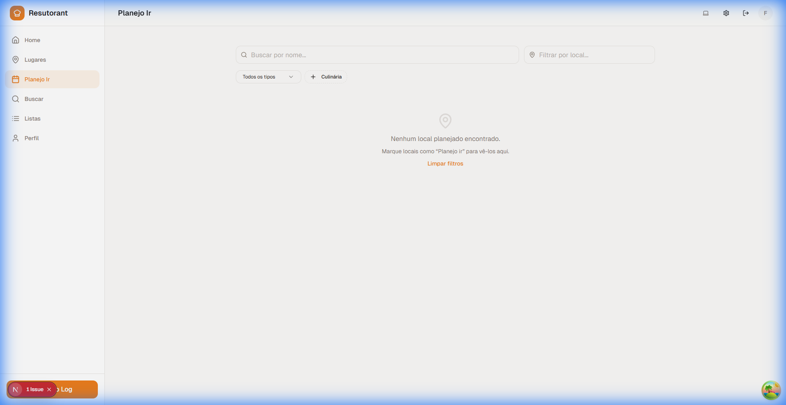
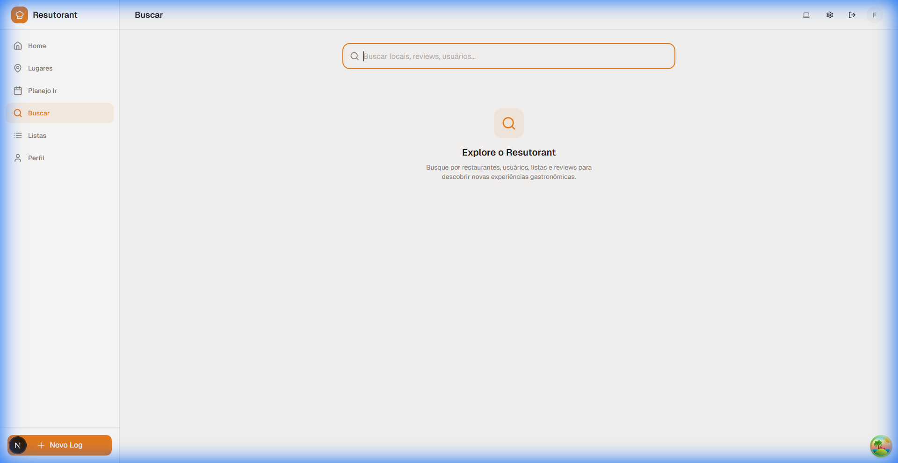
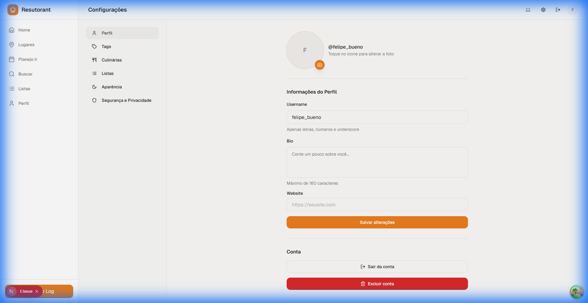

# Resutorant

A personal restaurant rating and dining planning platform.

This project lets users log their restaurant experiences, build lists of places to visit, and view detailed statistics about their dining habits.

## Overview

Resutorant is a modern web application built with Next.js, designed as a solid personal tool for foodies and dining enthusiasts. It offers a rich, responsive interface for managing culinary memories.

## Key Features

- **Dashboard:** An overview of recent activity and quick metrics.
- **Detailed Reviews:** Log ratings, prices, dates, and custom tags for every visit.
- **Lists and Planning:** Organize restaurants into lists (for example, "Best Burgers", "Romantic Dinner") and keep a "Want to Go" list.
- **Advanced Search:** Quickly find restaurants you have already visited or saved.
- **Profile and Statistics:** Analyze your habits with interactive charts and a complete history.
- **Customizable Settings:** Manage tags, cuisines, and account preferences.
- **Secure Authentication:** A robust, secure login system via Supabase.

## Tech Stack

- **Framework:** Next.js (App Router)
- **Language:** TypeScript
- **Styling:** Tailwind CSS
- **UI Components:** Radix UI, Lucide React
- **Animations:** Framer Motion
- **State/Data Management:** TanStack Query (React Query)
- **Forms:** React Hook Form, Zod
- **Charts:** Recharts
- **Backend & Database:** Supabase
- **Utilities:** date-fns, clsx, tailwind-merge

## Screenshots

### Dashboard



### User Profile



### Lists



### Planning



### Search



### Settings



## Getting Started

Follow these instructions to set the project up locally.

### Prerequisites

- Node.js (LTS version recommended)
- npm or yarn

### Installation

1.  Clone the repository:

    ```bash
    git clone https://github.com/your-username/resutorant.git
    cd resutorant
    ```

2.  Install the dependencies:

    ```bash
    npm install
    ```

3.  Configure the environment variables:
    Create a `.env.local` file at the project root and add your Supabase keys:

    ```env
    NEXT_PUBLIC_SUPABASE_URL=your_supabase_url
    NEXT_PUBLIC_SUPABASE_ANON_KEY=your_anon_key
    ```

4.  Start the development server:

    ```bash
    npm run dev
    ```

5.  Open the application at `http://localhost:3000`.

## Project Structure

- `/app`: Application routes and pages (Next.js App Router).
- `/components`: Reusable UI components.
- `/lib`: Utility functions, hooks, and configuration.
- `/public`: Static files.
- `/screenshots`: Images used in this README.

---

Built by Felipe Bueno.
